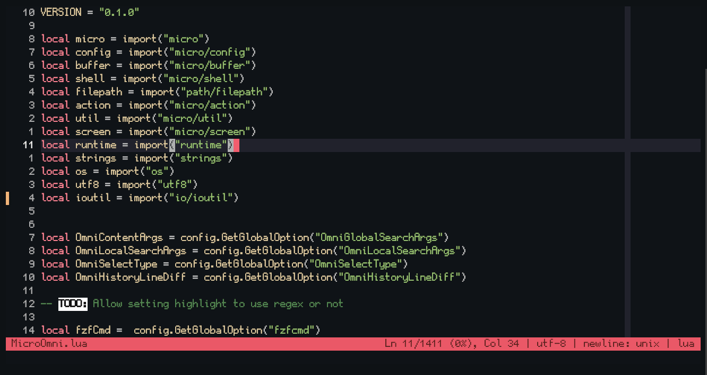
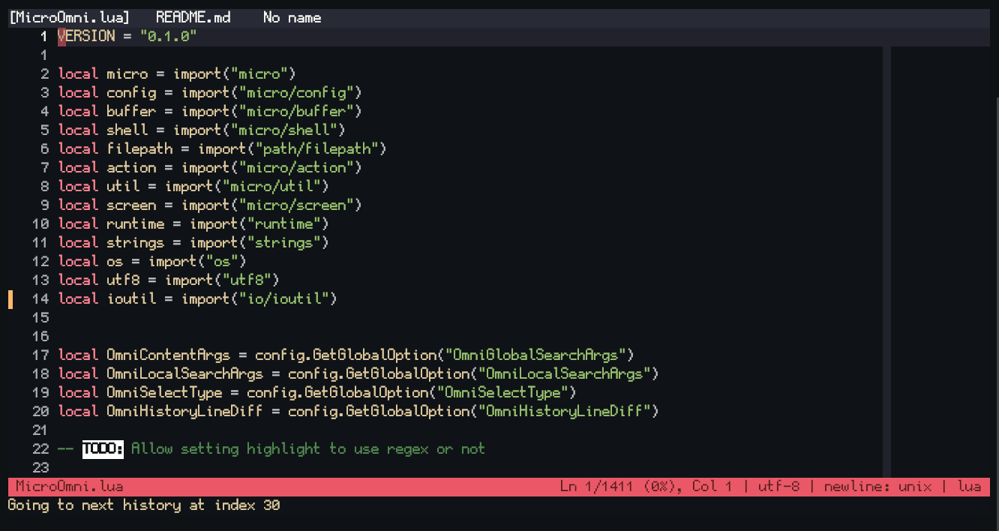
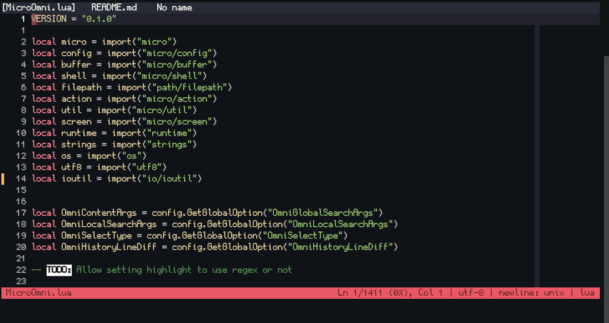

# 🧰 Micro Omni

A swiss army knife plugin that super charges ⚡️ your micro text editor

List of features:
- ⚓️ Project Navigations:
    - [🔍️ Fuzzy Search For Text Globally](#%EF%B8%8F-fuzzy-search-for-text-globally)
    - [🧭 Fuzzy Search For Text Locally](#-fuzzy-search-for-text-locally)
    - [📝 Fuzzy Search For Files](#-fuzzy-search-for-files)
- 🖱️ Cursor Control:
    - [🚀 Word Jumping (EasyMotion)](#-word-jumping-easymotion)
    - [📔 Global Cursor History](#-global-cursor-history)
    - [🔲 Centering Cursor To Viewport](#-centering-cursor-to-viewport)
    - [🦘 Jump Selection](#-jump-selection)
    - [🔀 Better Multi Cursor](#-better-multi-cursor)
- 📑 Tab Control:
    - [🗃️ Fuzzy Search For Opened Tabs](#%EF%B8%8F-fuzzy-search-for-opened-tabs)
    - [➕ Newtab Next To Current Tab](#-newtab-next-to-current-tab)
    - [↔️ Tab Bar Scrolling](#%EF%B8%8F-tab-bar-scrolling)
- 📜 Buffers Actions:
    - [🧦 Diff View](#-diff-view)
    - [🔦 Highlight Only (Before finding next)](#-highlight-only-before-finding-next)
    - [📁 Copy Current File Path](#-copy-current-file-path)
    - [🗺️ Minimap](#%EF%B8%8F-minimap)
- (WIP) Bracket jumping without on top of it
- (WIP) Content selection within brackets
- (WIP) Resize split with keyboard <!-- Using https://github.com/zyedidia/micro/issues/1807#issuecomment-1907899274 -->

---

## 📦️ Installation
You can install MicroOmni using `micro -plugin install OmniMicro` by either
- Add it to `"pluginrepos"` in `settings.json`, like
``` json
"pluginrepos": [
    "https://raw.githubusercontent.com/Neko-Box-Coder/MicroOmni/master/repo.json"
]
```
- Or using the [unofficial-plugin-channel](https://github.com/Neko-Box-Coder/unofficial-plugin-channel), like
```json
"pluginchannels": [
    "https://raw.githubusercontent.com/Neko-Box-Coder/unofficial-plugin-channel/main/channel.json"
]
```

- Alternatively, you can `git clone https://github.com/Neko-Box-Coder/MicroOmni` to your micro `plug` directory

---

## 📐 Requirements
- micro
    - micro [v2.0.14](https://github.com/zyedidia/micro/releases/tag/v2.0.14)
    - [My custom build of micro (dev)](https://github.com/Neko-Box-Coder/micro-dev/actions)
- fzf
- ripgrep
- bat
- diff (Windows)

All of these are available for Unix and Windows
> Windows link to requirements
>
> [https://github.com/junegunn/fzf/releases](https://github.com/junegunn/fzf/releases)
>
> [https://github.com/BurntSushi/ripgrep/releases](https://github.com/BurntSushi/ripgrep/releases)
>
> [https://github.com/sharkdp/bat/releases](https://github.com/sharkdp/bat/releases)
>
> [https://gnuwin32.sourceforge.net/packages/diffutils.htm](https://gnuwin32.sourceforge.net/packages/diffutils.htm)

Alternatively, you can get all the required executables you need for Windows in [Release](https://github.com/Neko-Box-Coder/MicroOmni/releases/tag/v0.0.1)
> [!NOTE]
> On Windows, the directory that has the required executables must be added to the PATH environment variable

---

## 🔍️ Fuzzy Search For Text Globally


> [!NOTE]
> The above gif is from older version.
> The latest version will show the default keybindings in fzf
> 

Recommended binding:
```json
    "Alt-F": "command:OmniGlobalSearch",
    //Windows
    "Alt-Shift-F": "command:OmniGlobalSearch"
```

To find a with keyword(s), launch command `OmniGlobalSearch` which is bindable to a key.
1. Enter the search directory, empty current root directory. `{fileDir}` can be used to substitute with current file directory
2. Enter keywords (separated by spaces) to be searched (This is using ripgrep and not fuzzy search)
3. If successful, a fzf window will be launched. You can now filter with fzf fuzzy search. 
4. Here are the keybindings by default configured:
    - **enter**: Select
    - **alt-enter**: Output the current filtered results to a new buffer
    - **up/down**: Navigate results
    - **alt-up / alt-down**: Navigate half page of results
    - **page-up / page-down**: Scroll up and down for the preview window
    - **alt-f**: Search again with text in the input field (**Non fuzzy** but case insensitive)
    - **alt-q**: Abort

### ⚙️ Fuzzy Search Settings
- `OmniFzfCmd`: The `fzf` location.
    - Defaults to `"fzf"`
- `OmniNewFileMethod`: How to open the new file. Available options are:
    - `smart_newtab`: (Default) Opens the new file in newtab if not opened already
    - `thispane`: Opens in current pane
    - `newtab`: Opens in new tab
    - `vsplit`: Opens in new pane as vertical split
    - `hsplit`: Opens in new pane as horizontal split
- `OmniGlobalSearchArgs`: Argument to be passed to fzf. It defaults to the following:
```lua
Common.OmniContentArgs =
            "--header='enter: select | alt-enter: output filtered results | alt-q/esc: exit | "..
            "page-[up/down]: preview-[up/down] | alt-[up/down]: half-page-[up/down]' "..
            "--bind 'alt-f:reload:rg --glob=!.git/ -i -F -uu -n {q}' "..
            "--delimiter : -i --reverse "..
            "--bind page-up:preview-half-page-up,page-down:preview-half-page-down,"..
            "alt-up:half-page-up,alt-down:half-page-down,alt-q:abort "..
            "--bind 'alt-enter:change-multi+select-all+accept' "..
            "--preview-window 'down,+{2}-/2' "..
            "--preview 'bat -f -n --highlight-line {2} {1}'"
```

---

## 🧭 Fuzzy Search For Text Locally



Recommended binding:
```json
    "Alt-f": "command:OmniLocalSearch"
```

Similar to "Fuzzy Search For Text Globally", this do a fuzzy search for the current file.
This is achieved by `bat` the file on disk to `fzf`, therefore you should save before searching.

The default control is the same as "Fuzzy Search For Text Globally".

To search, simply launch the `OmniLocalSearch` command.

### ⚙️ Fuzzy Search Settings
- `OmniLocalSearchArgs`: Argument to be passed to fzf with `{filePath}` substitute with 
the current file path. It defaults to the following:
```lua
Common.OmniLocalSearchArgs =
            "--header='enter: select | alt-enter: output filtered results | alt-q/esc: exit | "..
            "page-[up/down]: preview-[up/down] | alt-[up/down]: half-page-[up/down]' "..
            "--bind 'start:reload:bat -n --decorations always {filePath}' "..
            "-i --reverse "..
            "--bind page-up:preview-half-page-up,page-down:preview-half-page-down,"..
            "alt-up:half-page-up,alt-down:half-page-down,alt-q:abort "..
            "--bind 'alt-enter:change-multi+select-all+accept' "..
            "--preview-window 'down,+{1}-/2' "..
            "--preview 'bat -f -n --highlight-line {1} {filePath}'"
```

---

## 📝 Fuzzy Search For Files


Recommended binding:
```json
    "Alt-G": "command:OmniGotoFile",
    //Windows
    "Alt-Shift-G": "command:OmniGotoFile"
```

Similar to "Fuzzy Search For Text Globally", this do a fuzzy search for all the files
The default control is the same as "Fuzzy Search For Text Globally".

To search, simply launch the `OmniGotoFile` command.

### ⚙️ Fuzzy Search Settings
- `OmniNewFileMethod`: Same as previous
- `OmniGotoFileArgs`: Argument to be passed to fzf. It defaults to the following:
```lua
Common.OmniGotoFileArgs = 
            "--header='enter: select | alt-enter: output filtered results | alt-q/esc: exit | "..
            "page-[up/down]: preview-[up/down] | alt-[up/down]: half-page-[up/down]' "..
            "-i --reverse "..
            "--bind page-up:preview-half-page-up,page-down:preview-half-page-down,"..
            "alt-up:half-page-up,alt-down:half-page-down,alt-q:abort "..
            "--bind 'alt-enter:change-multi+select-all+accept' "..
            "--preview-window 'down' "..
            "--preview 'bat -f -n {}'"```

## 🚀 Word Jumping (EasyMotion)
To jump to a word anywhere on the screen, launch the `OmniJump` command **WITH** a keybinding


Recommended binding:
```json
    "Alt-j": "command:OmniJump"
```

---

## 📔 Global Cursor History
When you are editing multiple files or jumping between different functions, 
a history of the cursor location is stored. You can go to previous or next cursor position
by launching the `OmniPreviousHistory` and `OmniNextHistory` commands.

This is similar to the navigate back and forward commands in VSCode


Recommended binding:
```json
    "Alt-{": "command:OmniPreviousHistory",
    "Alt-}": "command:OmniNextHistory",
    //Windows
    "Alt-Shift-{": "command:OmniPreviousHistory",
    "Alt-Shift-}": "command:OmniNextHistory"
```

### ⚙️ Global Cursor History Settings
- `OmniNewFileMethod`: Same as previous
- `OmniHistoryLineDiff`: Sets how many line difference count as new cursor history. Defaults to 5
- `OmniHistoryTimeTravelMulti`: Multiplier to `OmniHistoryLineDiff` when in cursor history

---

## 🔲 Centering Cursor To Viewport
It centers your cursor to the middle of your viewport.


Recommended binding:
```json
    "Alt-m": "command:OmniCenter"
```

---

## 🦘 Jump Selection


Recommended binding:
```json
    "Alt-J": "command-edit:OmniJumpSelect ",
    //Windows
    "Alt-Shift-J": "command-edit:OmniJumpSelect "
```

To select a section based on line number, launch the `OmniJumpSelect` command with 
the line number specified. 

By default it uses relative line numbers, so 5 is 5 lines down and -5 is 5 lines up.
This can be configured to use absolute line number. See settings.

### ⚙️ Jump Selection Type Settings
- `OmniSelectType`: Sets the jump selection type. Can either be `relative` (default) or `absolute`

---

## 🔀 Better Multi Cursor

It spawns/moves your cursor to the next [highlight](#-highlight-only-before-finding-next) match, 
or act the same as `SpawnMultiCursor` if there's no [highlight](#-highlight-only-before-finding-next)

Meaning you can use regex expression to spawn multi-cursors.

Recommended binding:
```json
    "Alt-d": "command:OmniSpawnCursorNextHighlight"
    //OmniMoveLastCursorNextHighlight
```

### ⚙️ Better Multi Cursor Settings
Due to how the lua interface works, `AddCursor()` (from micro) was not added until recently. 
Therefore, a workaround was created to add multi cursor but this doesn't behave exactly like 
`SpawnMultiCursor`.

The differences are that `AddCursor()` will **select** the highlight text but the workaround will 
simply just add the cursor to the end of the highlight.

This can be set with `OmniCanUseNewCursor`.

If you are on latest master or using [my fork](https://github.com/Neko-Box-Coder/micro-dev/actions)
you can safely turn `OmniCanUseAddCursor` on, otherwise just leave it because it can crash micro.

- `OmniCanUseAddCursor`: Sets if MicroOmni can use the `AddCursor()` interface or not.
    - Defaults to `false`

---

## 🗃️ Fuzzy Search For Opened Tabs


Recommended binding:
```json
    "Alt-T": "command:OmniTabSearch",
    //Windows
    "Alt-Shift-T": "command:OmniTabSearch"
```

Similar to "Fuzzy Search For Text Globally", this do a fuzzy search for all the files
The default control is the same as "Fuzzy Search For Text Globally".

To search, simply launch the `OmniTabSearch` command.

### ⚙️ Fuzzy Search Settings
- `OmniNewFileMethod`: Same as previous
- `OmniTabSearchArgs`: Argument to be passed to fzf. It defaults to the following:
```lua
Common.OmniTabSearchArgs = 
            "--header='enter: select | alt-enter: output filtered results | alt-q/esc: exit | "..
            "page-[up/down]: preview-[up/down] | alt-[up/down]: half-page-[up/down]' "..
            "--bind 'start:reload:bat {filePath}' "..
            "--delimiter : -i --reverse "..
            "--bind page-up:preview-half-page-up,page-down:preview-half-page-down,"..
            "alt-up:half-page-up,alt-down:half-page-down,alt-q:abort "..
            "--bind 'alt-enter:change-multi+select-all+accept' "..
            "--preview-window 'down,+{2}-/2' "..
            "--preview 'bat -f -n --highlight-line {2} {1}'"
```

---

## ➕ Newtab Next To Current Tab
You can create a newtab either on the right or left of the current tab by launching 
`OmniNewTabRight` or `OmniNewTabLeft` command


Recommended binding:
```json
    "Alt-t": "command:OmniNewTabRight"
```

---

## ↔️ Tab Bar Scrolling
When you have too many tabs, you can scroll via them without switching by launching
`OmniTabScrollLeft` or `OmniTabScrollLeft` command


Recommended binding:
```json
    "Alt-PageUp": "command:OmniTabScrollLeft",
    "Alt-PageDown": "command:OmniTabScrollRight"
```

---

## 🧦 Diff View
To compare the current buffer with another buffer of file, launch the `OmniDiff` command.
Buffers are not required to be saved in order to perform the diff.


When being asked on what to diff, you can either specify a **filename** or a **tab**
The syntax for diffing a tab is as follow
`tab:[+/-]<tab index>[:<split index>]`

With `+` or `-` means it will be relative tab index, or absolute otherwise, similar to `tabmove`.
The split index can be used to specify which split to be diff against

Recommended binding:

None (Invoke it in command pane)

---

## 🔦 Highlight Only (Before finding next)
To highlight anything without going to it, launch the `OmniHighlightOnly` command.


Recommended binding:
```json
    "Alt-h": "command:OmniHighlightOnly"
```

---

## 📁 Copy Current File Path
You can copy the current file absolute or relative path with `OmniCopyRelativePath` and 
`OmniCopyAbsolutePath` command.

Recommended binding:

None (Invoke it in command pane)

---

## 🗺️ Minimap

Recommended binding:
```json
    "Alt-M": "command:OmniMinimap",
    //Windows
    "Alt-Shift-M": "command:OmniMinimap"
```

To see an overview of the current file based on indentation, launch the `OmniMinimap` command.
By default it will show neighboring lines as "context" if they have the same indentations

### ⚙️ Minimap Settings
- `OmniMinimapMaxIndent`: Max indent limit to be shown in the minimap
    - Defaults to 5
- `OmniMinimapContextNumLines`: Max number of context lines
    - Defaults to 20
- `OmniMinimapMinDistance`: Min skipping distance for the minimap
    - Defaults to 20
- `OmniMinimapMaxColumns`: Max number of columns in minimap, and use "..." if doesn't fit
    - Defaults to 75
- `OmniMinimapTargetNumLines`: Number of lines aiming to have for the minimap
    - Defaults to 100
- `OmniMinimapScrollContent`: Automatically scroll the content buffer when navigating in the minimap
    - Defaults to true
