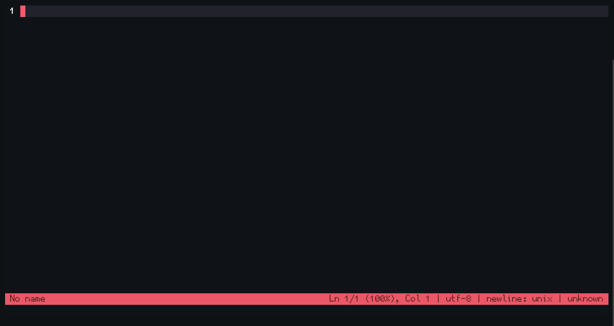
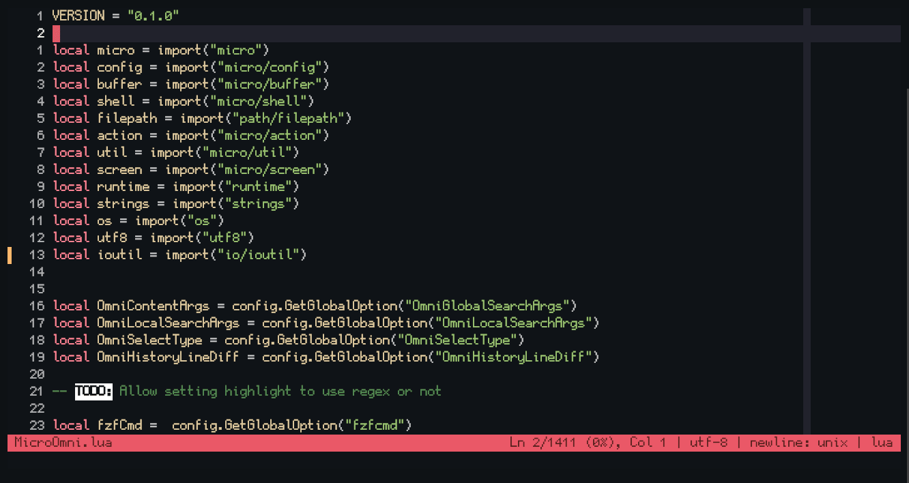

# 🧰 Micro Omni

A swiss army knife plugin that super charges ⚡️ your micro text editor

List of features:
- ⚓️ Project Navigations:
    - [🔍️ Fuzzy Search For Text Globally](#%EF%B8%8F-fuzzy-search-for-text-globally)
    - [🧭 Fuzzy Search For Text Locally](#-fuzzy-search-for-text-locally)
    - [📝 Fuzzy Search For Files](#-fuzzy-search-for-files)
- 🖱️ Cursor Control:
    - [🚀 Word Jumping (EasyMotion)](#-word-jumping-easymotion)
    - [📔 Global Cursor History](#-global-cursor-history)
    - [🔲 Centering Cursor To Viewport](#-centering-cursor-to-viewport)
    - [🦘 Jump Selection](#-jump-selection)
- 📜 Buffer/Tab Actions:
    - [🗺️ Minimap](#%EF%B8%8F-minimap)
    - [🧦 Diff View](#-diff-view)
    - [🔦 Highlight Only (Before finding next)](#-highlight-only-before-finding-next)
    - [📑 Newtab Next To Current Tab](#-newtab-next-to-current-tab)
    - [📁 Copy Current File Path](#-copy-current-file-path)
- (WIP) Bracket jumping without on top of it
- (WIP) Contect selection within brackets
- (WIP) Resize split with keyboard <!-- Using https://github.com/zyedidia/micro/issues/1807#issuecomment-1907899274 -->

## 📦️ Installation
You can install MicroOmni using `micro -plugin install OmniMicro` by either
- Add it to `"pluginrepos"` in `settings.json`, like
``` json
"pluginrepos": [
    "https://raw.githubusercontent.com/Neko-Box-Coder/MicroOmni/master/repo.json"
]
```
- Or using the [unofficial-plugin-channel](https://github.com/Neko-Box-Coder/unofficial-plugin-channel), like
```json
"pluginchannels": [
    "https://raw.githubusercontent.com/Neko-Box-Coder/unofficial-plugin-channel/main/channel.json"
]
```

- Alternatively, you can `git clone https://github.com/Neko-Box-Coder/MicroOmni` to your micro `plug` directory


## 📐 Requirements
- micro
    - micro [nightly](https://github.com/zyedidia/micro/releases/tag/nightly)
    - [Or from my branch (dev) github action artifacts](https://github.com/Neko-Box-Coder/micro-dev/actions))
- fzf
- ripgrep
- bat
- diff (Windows)

All of these are available for Unix and Windows
> Windows link to requirements
>
> [https://github.com/junegunn/fzf/releases](https://github.com/junegunn/fzf/releases)
>
> [https://github.com/BurntSushi/ripgrep/releases](https://github.com/BurntSushi/ripgrep/releases)
>
> [https://github.com/sharkdp/bat/releases](https://github.com/sharkdp/bat/releases)
>
> [https://gnuwin32.sourceforge.net/packages/diffutils.htm](https://gnuwin32.sourceforge.net/packages/diffutils.htm)

Alternatively, you can get all the required executables you need for Windows in [Release](https://github.com/Neko-Box-Coder/MicroOmni/releases)
> [!NOTE]
> On Windows, the directory that has the required executables must be added to the PATH environment variable


## 🔍️ Fuzzy Search For Text Globally



Recommended binding:
```json
{
    "Alt-F": "command:OmniGlobalSearch",
    //Windows
    "Alt-Shift-F": "command:OmniGlobalSearch"
}
```

To find a with keyword(s), launch command `OmniGlobalSearch` which is bindable to a key.
1. `{fileDir}` can be used to substitute the directory path of the current file. 
2. If successful, a fzf window will be launched. Here are the keybindings by default:
    - up/down: Navigate results
    - alt-up / alt-down: Navigate half page of results
    - page-up / page-down: Scroll up and down for the preview window
    - alt-f: Search again with text in the input field (**Non fuzzy** but case insensitive)

### ⚙️ Fuzzy Search Settings
- `OmniFzfCmd`: The `fzf` location.
    - Defaults to `"fzf"`
- `OmniNewFileMethod`: How to open the new file. Available options are:
    - `smart_newtab`: (Default) Opens the new file in newtab if not opened already
    - `thispane`: Opens in current pane
    - `newtab`: Opens in new tab
    - `vsplit`: Opens in new pane as vertical split
    - `hsplit`: Opens in new pane as horizontal split
- `OmniGlobalSearchArgs`: Argument to be passed to fzf. It defaults to the following:
```lua
OmniContentArgs =   "--bind 'alt-f:reload:rg -i -F -uu -n {q}' "..
                    "--delimiter : -i --reverse "..
                    "--bind page-up:preview-half-page-up,page-down:preview-half-page-down,"..
                    "alt-up:half-page-up,alt-down:half-page-down "..
                    "--preview-window 'down,+{2}-/2' "..
                    "--preview 'bat -f -n --highlight-line {2} {1}'"
```

## 🧭 Fuzzy Search For Text Locally


Recommended binding:
```json
{
    "Alt-f": "command:OmniLocalSearch"
}
```

Similar to "Fuzzy Search For Text Globally", this do a fuzzy search for the current file.
This is achieved by `bat` the file on disk to `fzf`, therefore you should save before searching.

The default control is the same as "Fuzzy Search For Text Globally".

To search, simply launch the `OmniLocalSearch` command.

### ⚙️ Fuzzy Search Settings
- `OmniLocalSearchArgs`: Argument to be passed to fzf with `{filePath}` substitute with 
the current file path. It defaults to the following:
```lua
OmniLocalSearchArgs =   "--bind 'start:reload:bat -n --decorations always {filePath}' "..
                        "-i --reverse "..
                        "--bind page-up:preview-half-page-up,page-down:preview-half-page-down,"..
                        "alt-up:half-page-up,alt-down:half-page-down "..
                        "--preview-window 'down,+{1}-/2' "..
                        "--preview 'bat -f -n --highlight-line {1} {filePath}'"
```

## 📝 Fuzzy Search For Files


Recommended binding:
```json
{
    "Alt-G": "command:OmniGotoFile"
    //Windows
    "Alt-Shift-G": "command:OmniGotoFile"
}
```

Similar to "Fuzzy Search For Files Recursively", this do a fuzzy search for all the files
The default control is the same as "Fuzzy Search For Files Recursively".

To search, simply launch the `OmniGotoFile` command.

### ⚙️ Fuzzy Search Settings
- `OmniNewFileMethod`: Same as previous
- `OmniGotoFileArgs`: Argument to be passed to fzf. It defaults to the following:
```lua
OmniGotoFileArgs =  "-i --reverse "..
                    "--bind page-up:preview-half-page-up,page-down:preview-half-page-down,"..
                    "alt-up:half-page-up,alt-down:half-page-down "..
                    "--preview-window 'down' "..
                    "--preview 'bat -f -n {}'"
```


## 🚀 Word Jumping (EasyMotion)
To jump to a word anywhere on the screen, launch the `OmniJump` command **WITH** a keybinding



Recommended binding:
```json
{
    "Alt-j": "command:OmniJump"
}
```


## 📔 Global Cursor History
When you are editing multiple files or jumping between different functions, 
a history of the cursor location is stored. You can go to previous or next cursor position
by launching the `OmniPreviousHistory` and `OmniNextHistory` commands.

This is similar to the navigate back and forward commands in VSCode


Recommended binding:
```json
{
    "Alt-{": "command:OmniPreviousHistory",
    "Alt-}": "command:OmniNextHistory",
    //Windows
    "Alt-Shift-{": "command:OmniPreviousHistory",
    "Alt-Shift-}": "command:OmniNextHistory"
}
```


### ⚙️ Global Cursor History Settings
- `OmniNewFileMethod`: Same as previous
- `OmniHistoryLineDiff`: Sets how many line difference count as new cursor history. Defaults to 5

## 🔲 Centering Cursor To Viewport
It centers your cursor to the middle of your viewport.


Recommended binding:
```json
{
    "Alt-m": "command:OmniCenter"
}
```

## 🦘 Jump Selection


Recommended binding:
```json
{
    "Alt-J": "command-edit:OmniJumpSelect ",
    //Windows
    "Alt-Shift-J": "command-edit:OmniJumpSelect "
}
```

To select a section based on line number, launch the `OmniJumpSelect` command with 
the line number specified. 

By default it uses relative line numbers, so 5 is 5 lines down and -5 is 5 lines up.
This can be configured to use absolute line number. See settings.

### ⚙️ Jump Selection Type Settings
- `OmniSelectType`: Sets the jump selection type. Can either be `relative` (default) or `absolute`

## 🗺️ Minimap

Recommended binding:
```json
{
    "Alt-M": "command:OmniMinimap",
    //Windows
    "Alt-Shift-M": "command:OmniMinimap",
}
```

To see an overview of the current file based on indentation, launch the `OmniMinimap` command.
By default it will show neighboring lines as "context" if they have the same indentations

### ⚙️ Minimap Settings
- `OmniMinimapMaxIndent`: Max indent limit to be shown in the minimap
    - Defaults to 5
- `OmniMinimapContextNumLines`: Max number of context lines
    - Defaults to 20
- `OmniMinimapMinDistance`: Min skipping distance for the minimap
    - Defaults to 20
- `OmniMinimapMaxColumns`: Max number of columns in minimap, and use "..." if doesn't fit
    - Defaults to 75
- `OmniMinimapTargetNumLines`: Number of lines aiming to have for the minimap
    - Defaults to 100
- `OmniMinimapScrollContent`: Automatically scroll the content buffer when navigating in the minimap
    - Defaults to true


## 🧦 Diff View
To compare the current buffer with another buffer of file, launch the `OmniDiff` command.
Buffers are not required to be saved in order to perform the diff.


When being asked on what to diff, you can either specify a **filename** or a **tab**
The syntax for diffing a tab is as follow
`tab:[+/-]<tab index>[:<split index>]`

With `+` or `-` means it will be relative tab index, or absolute otherwise, similar to `tabmove`.
The split index can be used to specify which split to be diff against

Recommended binding:

None (Invoke it in command pane)


## 🔦 Highlight Only (Before finding next)
To highlight anything without going to it, launch the `OmniHighlightOnly` command.


Recommended binding:
```json
{
    "Alt-h": "command:OmniHighlightOnly"
}
```


## 📑 Newtab Next To Current Tab
You can create a newtab either on the right or left of the current tab by launching 
`OmniNewTabRight` or `OmniNewTabLeft` command


Recommended binding:
```json
{
    "Alt-t": "command:OmniNewTabRight"
}
```


## 📁 Copy Current File Path
You can copy the current file absolute or relative path with `OmniCopyRelativePath` and 
`OmniCopyAbsolutePath` command.

Recommended binding:

None (Invoke it in command pane)


